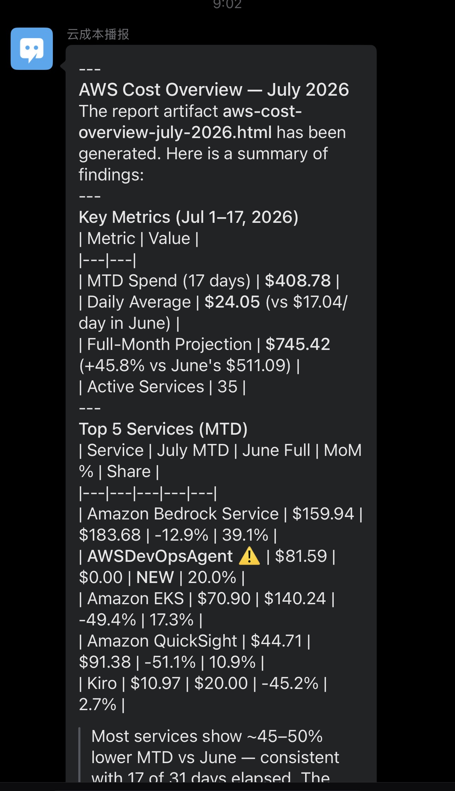
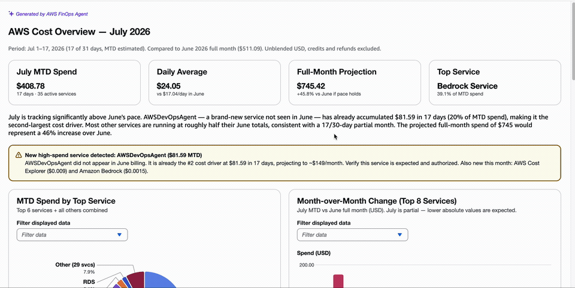
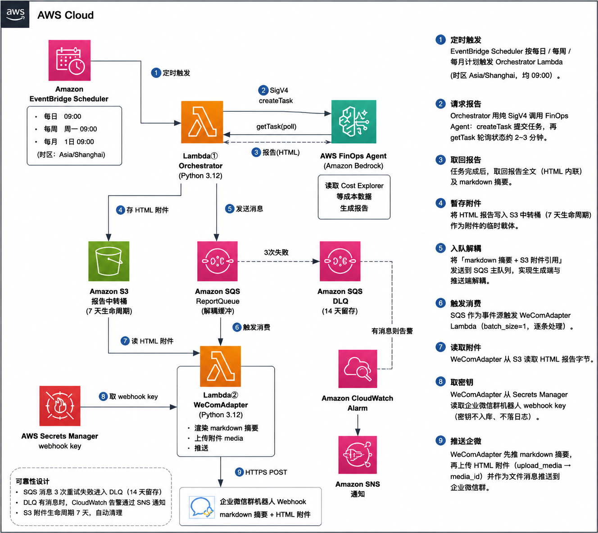
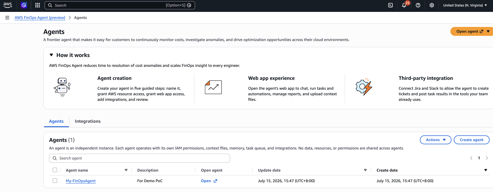

# FinOps Agent × 企业微信 成本报告推送

AWS FinOps Agent 生成成本报告，经两个 Lambda（Orchestrator + WeComAdapter，通过 SQS 解耦）推送到企业微信群机器人（markdown 摘要 + HTML 附件）。基础设施由 CDK（Python）定义。

## 效果展示

定时任务触发后，企业微信群机器人「云成本播报」收到的成本报告——含关键指标、Top 服务环比、异常标记与完整 HTML 附件：

| 推送效果 | 报告示范 |
|:---:|:---:|
|  |  |

## 关于 AWS FinOps Agent

AWS FinOps Agent（公开预览）是构建于 Amazon Bedrock 的 agentic AI，用于持续监控成本、调查成本异常并提供优化建议。它本身不存储数据，而是在用户授权下代表用户调用以下 AWS 服务的 API 来收集信息：

| 数据源 | 采集内容 | 方式 |
|--------|----------|------|
| AWS Cost Explorer | 成本与用量数据（回答成本问题、生成报告的主数据源） | 读取 |
| AWS Cost Anomaly Detection | 成本异常事件（事件触发的信号源） | 监听 |
| AWS CloudTrail（Event History） | 将成本尖峰关联到具体 API 变更事件，定位根因与责任人 | 关联 |
| AWS Cost Optimization Hub | 节省与优化建议 | 拉取 |
| AWS Compute Optimizer | 计算资源优化建议 | 拉取 |

此外，agent 可读取用户上传的 **context files**（账号-负责人映射、团队定义、打标签规范等）并跨会话记忆偏好，从而以组织自身术语解释成本问题。

三类核心能力：**事件触发的异常调查**、**自然语言成本问询**、**周期性成本报告**（daily/weekly/monthly，输出 HTML/PDF/PPT）。

**计费**：预览期 agent 本身免费，但其代调的底层 AWS API 按标准单价计费——本项目走「周期性成本报告」链路，主要产生 Cost Explorer 的 API 调用费用。

> 参考文档：
> [What is AWS FinOps Agent](https://docs.aws.amazon.com/finops-agent/latest/userguide/what-is.html)、
> [Use cases](https://docs.aws.amazon.com/finops-agent/latest/userguide/chatting-with-finops-agent.html)、
> [FAQs](https://aws.amazon.com/finops-agent/faqs/)

## 本项目定位：成本治理闭环的入口环节

本项目专注于成本治理闭环的**入口环节**——把 FinOps Agent 生成的成本报告主动推送到企业微信，让异常在第一时间进入团队视野，而非静静躺在控制台里无人问津。**本项目本身只负责「发现与推送」，不涉及后续的调查与执行。** 若要延伸为从发现到清理的完整闭环，**建议采用** AWS 官方博客 [《FinOps + DevOps 双 Agent — AI 驱动的云成本优化实战》](https://aws.amazon.com/cn/blogs/china/finops-devops-agent-ai-cost-optimize/) 提出的**双 Agent 协作方案**接力，将流程从传统的「天级/周级」压缩到「小时级」。下表中，本项目仅落地阶段 ①，②~④ 为推荐的后续方案：

| 阶段 | 承担者 | 职责 | 权限边界 |
|------|--------|------|----------|
| ① 发现与推送 | **本项目 + FinOps Agent** | 定时生成成本报告并推送企微；发现异常、关联 CloudTrail 定位根因、生成结构化排查清单 | 只读 |
| ② 结构化交接 | 排查清单 | 以「目标资源 + 验证命令 + 决策条件 + 预期收益 + 风险提示」的清单形式传递上下文，避免人工沟通丢信息 | — |
| ③ 验证与执行 | **DevOps Agent** | 验证资源运行时状态、CloudTrail 审计溯源、关联资源与依赖扫描、生成按依赖排序的清理脚本 | 可写，需人工确认 |
| ④ 回环验证 | DevOps Agent | 清理后重新扫描全部区域，确认资源已清除、账单止损，形成闭环 | 只读 |

**设计原则**（源自上述方案）：**关注点分离**（分析归 FinOps、执行归 DevOps）、**最小权限**（FinOps 只读、DevOps 可写但需授权）、**结构化交接**（排查清单承载上下文）、**人在回路**（是否删除等关键决策由人做出，Agent 只提供支撑）。

> 官方案例佐证：一次真实排查中，双 Agent 协作在数小时内揪出隐藏 18 个月、跨 3 个区域 24/7 空转的 SageMaker Canvas 会话，月省约 \$4,100（历史累计浪费约 \$47,629）。本项目的成本播报，正是让这类「成本黑洞」被及时看见的第一步。

## 架构图示

事件驱动、Serverless、通过 SQS 解耦的两段式流水线。基础设施全部由 CDK（Python）定义。



### 架构说明

1. **定时触发**：EventBridge Scheduler 按每日 / 每周 / 每月三种计划（时区 `Asia/Shanghai`，均 09:00）触发 Orchestrator Lambda。
2. **请求报告**：Orchestrator 用纯 SigV4（无 SDK）调用 FinOps Agent —— `createTask` 提交生成任务，再 `getTask` 轮询任务状态（PENDING → IN_PROGRESS → COMPLETED，约 2~3 分钟）。FinOps Agent 在后台读取 Cost Explorer 等成本数据生成报告。
3. **取回报告**：任务完成后，Orchestrator 经 `listArtifacts` / `getArtifactContent` 取回报告全文（HTML 内联）及 markdown 摘要。
4. **暂存附件**：Orchestrator 将 HTML 报告写入 S3 中转桶（7 天生命周期自动过期），仅作为附件的临时载体。
5. **入队解耦**：Orchestrator 把「markdown 摘要 + S3 附件引用」组装成消息发送到 SQS 主队列，实现生成端与推送端解耦。
6. **触发消费**：SQS 作为事件源触发 WeComAdapter Lambda（`batch_size=1`，逐条处理）。
7. **读取附件**：WeComAdapter 从 S3 读回 HTML 报告字节。
8. **取密钥**：WeComAdapter 从 Secrets Manager 读取企业微信群机器人 webhook key（密钥不入库、不落日志）。
9. **推送企微**：WeComAdapter 先推 markdown 摘要，再上传 HTML 附件（`upload_media` → `media_id`）并作为文件消息推送到企业微信群。

**可靠性**：消息在 SQS 重试 3 次仍失败则进入 DLQ（保留 14 天）；DLQ 一旦有消息，CloudWatch 告警经 SNS 通知，避免推送失败被静默丢弃。

## 前提

### AWS 账号与权限

本项目在部署与运行时依赖两类互相独立的 AWS 权限，请分别确认：

**1. FinOps Agent 侧（数据来源）**

- **Region 必须为 `us-east-1`**：FinOps Agent（预览期）仅在美国东部（弗吉尼亚北部）提供，agent 与其调用的 Cost Explorer 等 API 均在此 region。
- **在目标账号中创建一个 Agent**：登录控制台创建 agent 时，创建向导可**一键自动创建所需 IAM 角色并附加策略**（官方推荐，多数用户无需手动配置 IAM）。agent 角色由托管策略 `FinOpsAgentAgentPolicy` 授权，对成本与运维数据为**只读**（`ce:*`、`cost-optimization-hub:*`、`compute-optimizer:*`、`cloudtrail:LookupEvents` 等）。
- **账号类型决定数据范围**：在**管理账号（management account）**创建的 agent 可覆盖整个 Organization 的成本数据；在**成员账号**创建的 agent 仅能访问自身账号。请按需要的汇总范围选择创建位置。
- 创建完成后，将其 `agentSpaceId` 填入 CDK 代码（见下文）。

下图为 `us-east-1` 控制台中 AWS FinOps Agent 的 Agents 列表——已创建一个 agent（本例名为 `My-FinOpsAgent`），其 `agentSpaceId` 即从此处进入 agent 详情后获取：



**2. 部署者侧（本项目基础设施）**

- 一个可访问上述账号的 IAM 身份（IAM user / role / IAM Identity Center SSO 均可），凭证按标准方式配置即可，例如：

  ```bash
  aws configure                       # 或使用 SSO / 环境变量 / 命名 profile
  export AWS_REGION=us-east-1
  export CDK_DEFAULT_ACCOUNT=<你的账号ID>   # 或在 infra/app.py 中指定
  ```

- 该身份需具备用 CDK 部署本 stack 的权限：CloudFormation、Lambda、S3、SQS、Secrets Manager、EventBridge Scheduler、IAM（创建 Lambda 执行角色）、CloudWatch、SNS。运行时 Orchestrator Lambda 还会以其执行角色调用 `finops-agent:CreateTask/GetTask/ListArtifacts/GetArtifactContent`（已在 `infra/stack.py` 中授予）。

> IAM 权限细节以官方为准，参考文档：
> [IAM setup guide](https://docs.aws.amazon.com/finops-agent/latest/userguide/setting-up.html)、
> [Creating an agent](https://docs.aws.amazon.com/finops-agent/latest/userguide/creating-an-agent.html)

- **Node + AWS CDK CLI（版本 >= 2.1131.0）**：`aws-cdk-lib==2.261.0` 依赖 cloud-assembly schema 54，需 CDK CLI >= 2.1131.0，否则 synth/deploy 报 schema 不兼容。

  ```bash
  npm i -g aws-cdk        # 确认 cdk --version >= 2.1131.0
  ```

- **Python 虚拟环境 + 依赖**：

  ```bash
  python3 -m venv .venv
  .venv/bin/pip install -r requirements.txt
  ```

- **部署前需先创建 Agent 并填入 `agentSpaceId`**：按上文「FinOps Agent 侧」在 `us-east-1` 控制台创建 agent，取得其 `agentSpaceId` 后写入 CDK 代码（`infra/stack.py` 的 `AGENT_SPACE_ID`），再执行部署。

> **cdk.json 说明**：`cdk.json` 的 app 命令为 `.venv/bin/python -m infra.app`。
> - 用模块方式（`-m infra.app`）而非脚本路径调用，保证项目根目录在 `sys.path` 上，`from infra.stack import ...` 能正常 import。
> - 用 `.venv/bin/python` 而非系统 `python3`，保证使用装有 `aws-cdk-lib==2.261.0` 的虚拟环境。
>
> 因此从项目根目录直接运行 `cdk synth` / `cdk deploy` / `make deploy` 即可，**无需手动 export PYTHONPATH**。

## 推送调度与时间说明

由 EventBridge Scheduler 定时触发 Orchestrator，时区统一为 `Asia/Shanghai`：

| Schedule | cron 表达式 | 触发时机（北京时间） |
|----------|-------------|----------------------|
| DailySchedule | `cron(0 9 * * ? *)` | 每天 09:00 |
| WeeklySchedule | `cron(0 9 ? * MON *)` | 每周一 09:00 |
| MonthlySchedule | `cron(0 9 1 * ? *)` | 每月 1 号 09:00 |

**推送时间存在数分钟延迟属正常现象**，原因有二：一是 EventBridge Scheduler 本身允许分钟级的触发抖动；二是 Orchestrator 触发后需轮询等待 FinOps Agent 异步生成报告（实测约 2~3 分钟）后才会入队并推送。因此企业微信实际收到消息通常在整点后 2~6 分钟，而非精确 09:00:00。

> Orchestrator 轮询上限为 `max_polls × poll_interval = 20 × 15s = 5 分钟`。若报告生成超过该上限，消息将进入 DLQ 并触发告警，当次不推送。

## 成本评估

本方案的月度成本由两部分构成：**几乎恒定的 Serverless 基础设施费**（<$1/月，大头在 Secrets Manager 与 CloudWatch 告警），以及**随报告生成量变动的 FinOps Agent 底层 API 费**（主要是 Cost Explorer API）。以下估算基于默认三档调度（每日 + 每周 + 每月 ≈ **35 次/月**），region `us-east-1`，均为 2026-07 的官方公开单价。

### 1. FinOps Agent 调用（方案主变量）

FinOps Agent **预览期本身免费**（有月度用量上限），但它在生成报告时会**代表用户调用底层 AWS API**，这些 API 按标准价计费。本项目走「周期性成本报告」链路，产生的主要是 **Cost Explorer API** 调用（**$0.01 / 请求**，且**分页时每页算一次独立请求**）。

单次报告触发的 Cost Expoler (CE)请求数由 agent 内部决定、不由本项目控制，且随报告复杂度（Top 服务数、环比区间、异常检测范围）浮动，官方未公布精确值。下表按**每份报告 N 次 CE 请求**给出区间估算：

| 每份报告 CE 请求数 (N) | 月请求数（× 35） | 月费用（× $0.01） |
|:---:|:---:|:---:|
| 保守 · 10 | 350 | **$3.50** |
| 典型 · 30 | 1,050 | **$10.50** |
| 偏高 · 50 | 1,750 | **$17.50** |

> 注：本项目自身调用的 `finops-agent:CreateTask/GetTask/ListArtifacts/GetArtifactContent` 四个 API 在预览期不单独计费；上表计的是 agent **代调 Cost Explorer** 产生的费用。GA 后 FinOps Agent 是否对 agent 本身收费尚未公布，届时需重新评估。

### 2. Serverless 基础设施（近似恒定）

| 服务 | 用量（35 次/月） | 月费用 | 说明 |
|------|------------------|--------|------|
| **Secrets Manager** | 1 个 secret + ~35 次读取 | **~$0.40** | 每 secret $0.40/月，API 调用可忽略 |
| **CloudWatch** | 1 个 DLQ 告警 + 少量日志 | **~$0.10–0.50** | 告警 $0.10/个/月 |
| **Lambda** | ~70 次调用、~2.7k GB-秒 | **~$0** | 远在免费额度内（400,000 GB-秒 / 1M 请求） |
| **S3** | ~35 PUT/GET，报告 7 天过期 | **~$0** | 单份报告数百 KB，存储与请求费可忽略 |
| **SQS** | ~35 条消息 | **~$0** | 免费额度 1M 请求/月 |
| **EventBridge Scheduler** | 35 次触发 | **~$0** | $1/百万次，可忽略 |
| **SNS** | 仅 DLQ 告警时触发 | **~$0** | 正常无消息 |
| **小计** | | **< $1/月** | |

### 3. 合计

| 场景 | FinOps/CE API | 基础设施 | **月度合计** |
|------|:---:|:---:|:---:|
| 保守（N=10） | $3.50 | <$1 | **≈ $4–5** |
| 典型（N=30） | $10.50 | <$1 | **≈ $11–12** |
| 偏高（N=50） | $17.50 | <$1 | **≈ $18–19** |

**结论**：整体月度成本主要取决于 FinOps Agent 代调 Cost Explorer 的请求量，**典型量级约在每月 10 美元出头**；Serverless 基础设施部分近乎免费。若需压降，可减少调度频次（如仅保留每周 + 每月，从 35 次降到 ~5 次/月，CE 费用同比例下降约 85%）。

> **估算局限**：CE 请求数 N 为区间假设而非实测；上线后请以 **Cost Explorer 中 `AWS Cost Explorer` 服务的实际账单**校准。此外本估算未含跨账号/Organization 汇总带来的额外 CE 数据量。

> 参考文档（单价来源，均为公开定价）：
> [Cost Explorer 定价（API $0.01/请求）](https://aws.amazon.com/aws-cost-management/aws-cost-explorer/pricing/)、
> [Cost Explorer FAQs（分页每页计一次）](https://aws.amazon.com/aws-cost-management/aws-cost-explorer/faqs/)、
> [FinOps Agent 预览期免费、底层服务标准计费](https://aws.amazon.com/finops-agent/faqs/)

## 部署

```bash
make deploy
```

## 注入企微 webhook key（部署后，一次性；key 不入库）

Secrets Manager 中的 secret 在部署时创建但为空，webhook key 只在运行时通过下面的命令注入（**不写入仓库**）：

```bash
aws secretsmanager put-secret-value \
  --secret-id $(aws cloudformation describe-stack-resource \
    --stack-name FinOpsWeComStack --logical-resource-id WeComWebhookSecret \
    --query 'StackResourceDetail.PhysicalResourceId' --output text) \
  --secret-string '{"webhookKey":"<你的群机器人key>"}'
```

## 演示

```bash
make demo   # 手动触发一次 Orchestrator，企微群收到 markdown 摘要 + HTML 附件
```

## 测试

```bash
make test   # .venv/bin/python -m pytest tests/ -v，全部 PASS
```
